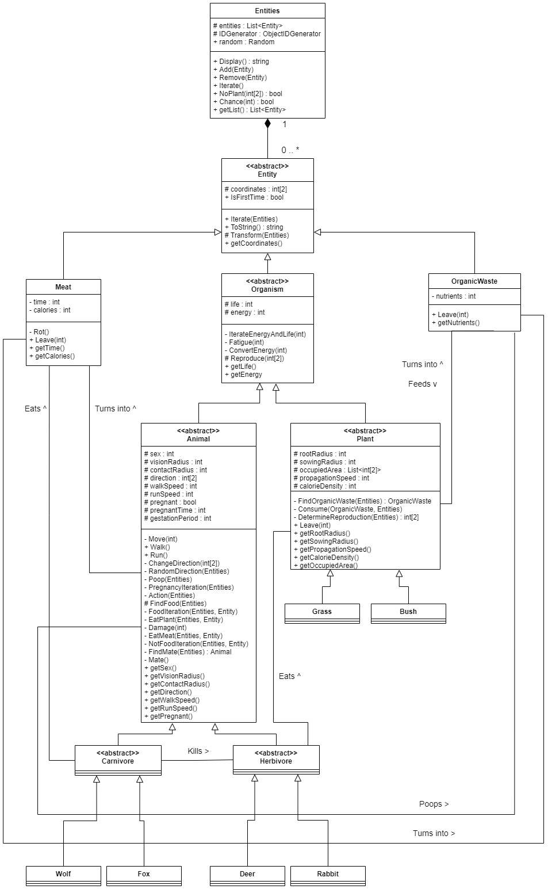

# Rapport Projet POO "Ecosystème"
## Objectif
Ceci est un projet de 3ème année à l'ECAM pour le cours de programmation orientée objet.
L'énoncé est disponible ici : [quentin-lurkin.xyz](https://quentin.lurkin.xyz/courses/poo/projet2021/index.html)
___
## Utilisation du programme
Par défaut, le programme crée 3 instances de chaque espèce à un endroit aléatoire (dans un plan de 100 x 100). Le programme vous demande avant chaque cycle combien d'itérations vous voulez exécuter.
### Création d'une nouvelle espèce
Pour créer une nouvelle espèce, rendez-vous dans le fichier "Species.cs". Créez-y une nouvelle classe basée sur la classe abstraite de votre choix (Plant, Herbivore ou Carnivore). Définissez les variables requises et définissez la méthode Reproduce(). Cela sera plus façile de copier une autre classe du même type et d'en modifier le nom et les variables. Voici un exemple:
``` C#
class Tree : Plant
    {
        //CONSTRUCTOR
        public Tree(int[] coordinates) :
        base(coordinates)
        {
            rootRadius = 50;
            sowingRadius = 10;
            propagationSpeed = 1;
            calorieDensity = 5;   //calories par life point
        }
        //METHODS
        protected override Organism Reproduce(int[] newCoordinates) { return new Tree((int[])coordinates.Clone()); }
    }
```
Si vous voulez qu'au lancement du programme, cette nouvelle classe soit également instanciée 3 fois, modifiez la methode OneOfEach de la classe Entities (fichier "Entities.cs") comme ceci :
``` C#
this.Add(new Tree(new int[] { random.Next(-100, 101), random.Next(-100, 101) }));
```
### Changement de la disposition de départ
Pour changer la disposition de départ des entités sur le plan, il faut rajouter/remplacer/modifier le code suivant dans le Main :
``` C#
entities.OneOfEach(3);
```
Si vous voulez par exemple manuellement rajouter un objet, faites de la manière suivante:
``` C#
entities.Add(new Tree(new int[] { 23, 65 }));
```
Dans le cas où vous avez besoin composant aléatoire, vous pouvez accéder à l'attribut "random" de l'instance de la classe Entities, par exemple:
``` C#
entities.random.Next(55);
```
Il vous est également mis à disposition quelques scénarios pour tester un comportement spécifique. Ils sont mis dans le Main en commentaire, il vous suffit donc d'enlever le "//" devant. Par exemple:
``` C#
entities.DeerDeer();
```
fera apparaître deux cerfs proches l'un de l'autre afin de pouvoir observer un accouplement.
___
## Diagrammes
### Diagramme de classes

### Diagramme de séquence

___
## Principes SOLID
### Principe de Substitution de Liskov
La définition du principe est la suivante :
> Si q(x) est une propriété démontrable pour tout objet x de type T, Alors q(y) doit est vraie pour tout objet y de type S où S est un sous-type de T.

Il définit ce qu'est un "bon" sous-type.
Une façon de voir que ce principe a été utilisé est que tout objet peut être converti en une des ses sous-classes.

### Principe ouvert/fermé
Ce principe affirme qu'une entité (classe, méthode, module...) doit être __ouverte à l'extension mais fermée à la modification__.
Un exemple de l'utilisatin de ce principe dans ce projet est que lors de la création d'une nouvelle espèce d'organisme, je ne dois pas modifier les superclasses.