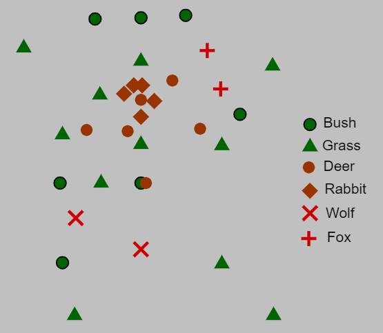
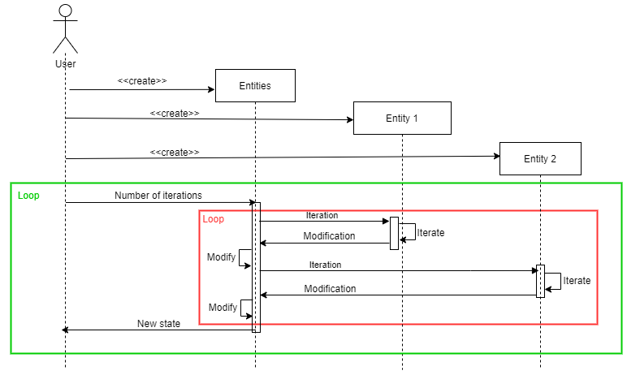

*Projet réalisé par **Eliott Nys** (195193) & **Matthis Brenez** (195003)*

---
# Rapport Projet POO "Ecosystème"
## Objectif
Ceci est un projet de 3ème année à l'ECAM pour le cours de programmation orientée objet.
L'énoncé est disponible ici : [quentin-lurkin.xyz](https://quentin.lurkin.xyz/courses/poo/projet2021/index.html)
___
## Utilisation du programme
Par défaut, le programme exécute un scénario dans lequel des plantes sont placées dans le plan, du temps est laissé à ces plantes pour se propager, puis des herbivores sont placés (et recoivent également un peu de temps pour procréer) et puis enfin des prédateurs sont insérés. Le plaçement de ces entités ressemble à ceci:



Le programme vous demande avant chaque cycle combien d'itérations vous souhaitez exécuter. Il est recommandé d'augmenter graduellement ce nombre pour se rendre compte du temps que prennent ces itérations en fonction du nombre d'entités (cela dépendra de la machine sur laquelle le programme tourne).
### Création d'une nouvelle espèce
Pour créer une nouvelle espèce, rendez-vous dans le fichier "Species.cs". Créez-y une nouvelle classe basée sur la classe abstraite de votre choix (Plant, Herbivore ou Carnivore). Définissez les variables requises et définissez la méthode Reproduce(). Cela sera plus façile de copier une autre classe du même type et d'en modifier le nom et les variables. Voici un exemple:
``` C#
class Tree : Plant
    {
        //CONSTRUCTOR
        public Tree(int[] coordinates) :
        base(coordinates)
        {
            rootRadius = 50;
            sowingRadius = 10;
            propagationSpeed = 1;
            calorieDensity = 5;   //calories par life point
        }
        //METHODS
        protected override Organism Reproduce(int[] newCoordinates) { return new Tree((int[])coordinates.Clone()); }
    }
```
### Changement de la disposition de départ
Pour changer la disposition de départ des entités sur le plan, il faut rajouter/remplacer/modifier le code suivant dans le Main :
``` C#
entities.Scenario1();
```
Si vous voulez par exemple manuellement rajouter un objet, faites de la manière suivante:
``` C#
entities.Add(new Tree(new int[] { 23, 65 }));
```
Dans le cas où vous avez besoin d'un composant aléatoire, vous pouvez accéder à l'attribut "random" de l'instance de la classe Entities, par exemple,
``` C#
entities.random.Next(55);
```
Il vous est également mis à disposition quelques scénarios pour tester un comportement spécifique. Ils sont mis dans le Main en commentaire, il vous suffit donc d'enlever le "//" devant. Par exemple:
``` C#
entities.DeerDeer();
```
fera apparaître deux cerfs proches l'un de l'autre afin de pouvoir observer un accouplement. Où encore,
``` C#
entities.OneOfEach(3);
```
fera apparaître 3 instances de chaque organisme à un endroit aléatoire du plan. (**Attention**, si vous créez de nouvelles espèces, il faudra les rajouter à ce scénario ! Modifiez donc la méthode "OneOfEach" de la classe "Entities".)
___
## Fonctionnement général
Une instance *entities* de la classe *Entities* va contenir toutes les entités (instances d'une sous-classe de la classe abstraite *Entity*). Durant chaque itération de *entities*, les objets vont un à un subir une itération:
* Les organismes vont perdre de l'énergie et perdre ou regagner de la vie (ou peut-être même mourir)
* Les plantes vont se nourrir, se répandre ...
* Les animaux vont se déplacer, chercher de la nourriture, chasser, se nourrir, se reproduire, défequer ...
* La viande va pourrir
* ...

Il est important de noter qu'un objet peut intéragir plusieurs fois lors d'une iteration de *entities*. Donc il est par exemple normal de ne pas voir apparaître de la viande à l'endroit où un animal est mort, car une autre entité, dont l'iteration se passe après la mort de cet animal, aurait déjà pu la manger avant la fin de l'iteration de *entities*. Il faut donc être conscient qu'il y a une séquence d'évènements au sein d'une autre séquence d'évènements, mais que le programme n'affiche que les états entre les itérations de l'objet *entities*, et non entre les itérations des entités individuelles.
## Diagrammes
### Diagramme de classes

### Diagramme de séquence

___
## Principes SOLID
### Principe de Substitution de Liskov
La définition du principe est la suivante :
> Si q(x) est une propriété démontrable pour tout objet x de type T, Alors q(y) doit est vraie pour tout objet y de type S où S est un sous-type de T.

Il définit ce qu'est un **"bon" sous-type**.
Une façon de voir que ce principe a été utilisé est que tout objet peut être converti en une des ses sous-classes.

### Principe ouvert/fermé
Ce principe affirme qu'une entité (classe, méthode, module...) doit être __ouverte à l'extension mais fermée à la modification__.
Un exemple de l'utilisatin de ce principe dans ce projet est que lors de la création d'une nouvelle espèce d'organisme, je ne dois pas modifier les superclasses.